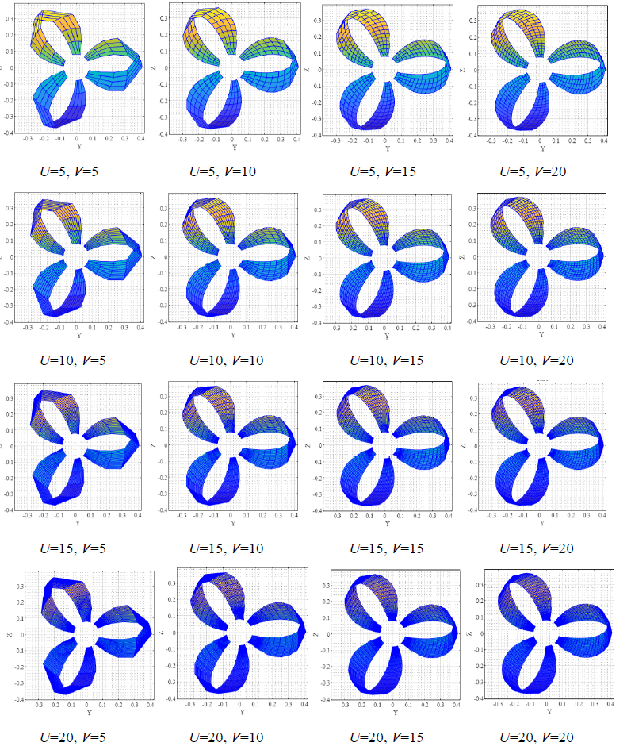
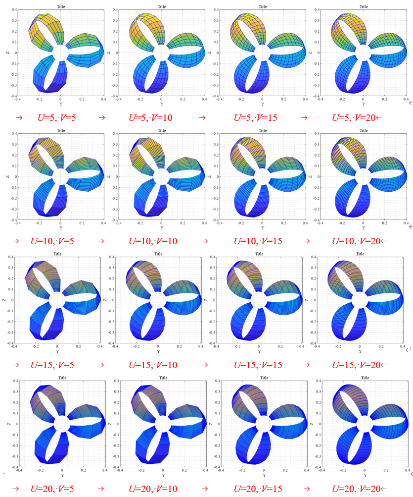

# PlatToroidalProp
An open-source platform for toroidal propeller
## Copyright
> The Copyright of the PlatToroidalProp belongs to the  Wuhan University of Technology. You are free to [use the PlatToroidalProp]
## video tutorial
> The video tutorial available at https://youtu.be/1HIGGtX6xr8 and https://youtu.be/fIKRcgGaz9g
>
## Update
> The PlatToroidalPropv1.1 is update.
> In version 1.1, the radial sampling method in the parameterization method has been updated to better represent the blade tip geometry information.
>>The blade build by PlatToroidalPropv1.0
> 
> >The blade build by PlatToroidalPropv1.1
> 

